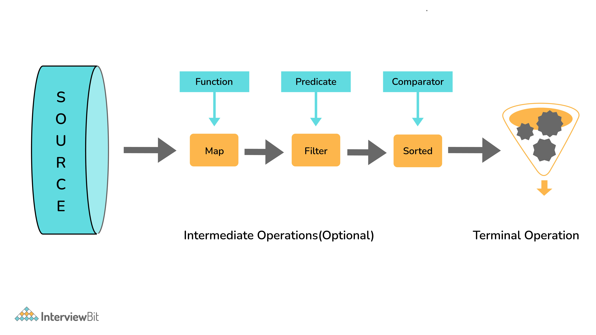

### **Java 8 streams API**

Introduced in Java 8, the Stream API is used to process collections of objects. A stream is a sequence of objects that supports various methods which can be pipelined to produce the desired result.

The features of Java stream are –

- A stream is not a data structure instead it takes input from the Collections, Arrays or I/O channels.
- Streams don't change the original data structure, they only provide the result as per the pipelined methods.
- Each intermediate operation is lazily executed and returns a stream as a result, hence various intermediate operations can be pipelined. Terminal operations mark the end of the stream and return the result.

A stream is an abstraction to express data processing queries in a declarative way.

A Stream, which represents a sequence of data objects & series of operations on that data is a data pipeline that is not related to Java I/O Streams does not hold any data permanently.

The key interface is java.util.stream.Stream\<T\>. It accepts Functional Interfaces so that lambdas can be passed. Streams support a fluent interface or chaining. Below is the basic stream timeline marble diagram:

**Pros:-**

1. Avoid writing anonymous impl
2. Saves boilerplate code
3. More readable

**Cons:-**

1. Hard to use without IDE
2. Hard to debug

Different Operations On Streams-

**Intermediate Operations:**

1. **map:** The map method is used to returns a stream consisting of the results of applying the given function to the elements of this stream.
   List number = Arrays.asList(2,3,4,5);
   List square = number.stream().map(x-\>x\*x).collect(Collectors.toList());
2. **filter:** The filter method is used to select elements as per the Predicate passed as argument.
   List names = Arrays.asList("Reflection","Collection","Stream");
   List result = names.stream().filter(s-\>s.startsWith("S")).collect(Collectors.toList());
3. **sorted:** The sorted method is used to sort the stream.
   List names = Arrays.asList("Reflection","Collection","Stream");
   List result = names.stream().sorted().collect(Collectors.toList());

**Terminal Operations:**

1. **collect:** The collect method is used to return the result of the intermediate operations performed on the stream.
   List number = Arrays.asList(2,3,4,5,3);
   Set square = number.stream().map(x-\>x\*x).collect(Collectors.toSet());
2. **forEach:** The forEach method is used to iterate through every element of the stream.
   List number = Arrays.asList(2,3,4,5);
   number.stream().map(x-\>x\*x).forEach(y-\>System.out.println(y));
3. **reduce:** The reduce method is used to reduce the elements of a stream to a single value.
   The reduce method takes a BinaryOperator as a parameter.
   List number = Arrays.asList(2,3,4,5);
   int even = number.stream().filter(x-\>x%2==0).reduce(0,(ans,i)-\> ans+i);
   Here ans variable is assigned 0 as the initial value and i is added to it .

**Important Points/Observations:**

1. A stream consists of source followed by zero or more intermediate methods combined together (pipelined) and a terminal method to process the objects obtained from the source as per the methods described.
2. Stream is used to compute elements as per the pipelined methods without altering the original value of the object

**map vs flatMap**

If employee having multiple phone numbers then we get 
empList.stream().map(e -> e.getPhoneNumbers().toList();
`[[phone numbers], [phone numbers]]`

So Using flatMap one to many
empList.stream().flatMap(e -> e.getPhoneNumbers().stream()).toList();
`[phone numbers]`

#
# **Java Collectors**

**Collectors** is one of the utility class in [JDK](https://www.geeksforgeeks.org/differences-jdk-jre-jvm/) which contains a lot of utility functions. It is mostly used with [Stream API](https://www.geeksforgeeks.org/stream-in-java/) as a final step. In this article, we will study different methods in the collector class.

When it comes to the functional style of programming in Java, we typically have few functions which we use widely and those functions are **filter()**, **map()**, **reduce()**, and **collect()** which belongs to the [Streams API](https://www.geeksforgeeks.org/stream-in-java/). **collect()** and **reduce()** methods are called as the terminal methods because here, the operation gets terminated with some outcome. Functions associated with Collectors usually get used inside collect() methods. Collectors class is part of Stream package and can be imported as:

The following are the various methods to perform operations on the above cities:

**1.** [Collector\<T, ?, List\<T\>\> toList():](https://www.geeksforgeeks.org/collectors-tolist-method-in-java-with-examples/) Transforms the input elements into a new List and returns a Collector. Here, **T** is the type of the input elements. In the following example, we are trying to process the list of cities whose temperature is more than 10, and get only the city names.

To do so, we use **filter()** to apply the filter check of temperature, we use **map()** to transform the city name and use **collect()** to collect these city names. Now this **collect()** method is basically used for collecting the elements passed though stream and its various functions and return a [List instance](https://www.geeksforgeeks.org/list-interface-java-examples/).

list().stream()

.filter(f -\> f.getTemperature() \> 10)

.map(f -\> f.getName())

.collect(Collectors.toList());

**Output:**

_[New Delhi, Mexico, New York, Dubai, London, Kolkata, Sydney, Mexico, Dubai]_

**2.** [Collector\<T, ?, Set\<T\>\> toSet():](https://www.geeksforgeeks.org/collectors-toset-in-java-with-examples/) Transforms the input elements into a new Set and returns a Collector. This method will return a Set instance and it doesn't contain any duplicates.

list.stream()

.filter(f -\> f.getTemperature() \> 10)

.map(f -\> f.getName())

.collect(Collectors.toSet())

**Output:**

_[New York, New Delhi, London, Mexico, Kolkata, Dubai, Sydney]_

Here, we can notice in the output that Mexico and Dubai have not been repeated.

**3.** [Collector\<T, ?, C\> toCollection(Supplier \<C\> collectionFactory):](https://www.geeksforgeeks.org/java-stream-collectors-tocollection-in-java/) Transforms the input elements into a new Collection, and returns a Collector. If we observe toList() and toSet() methods discussed above, We don't have control over their implementations. So with toCollection() we can achieve custom implementation where C is the type of the resulting collection and T is the type of the input elements.

list()

.stream()

.map(f -\> f.getName())

.collect(Collectors.toCollection(List::new))

**Output:**

_[New Delhi, Mexico, New York, Dubai, London, Alaska, Kolkata, Sydney, Mexico, Dubai]_

Similarly, we can use all other implementation classes such as [ArrayList](https://www.geeksforgeeks.org/arraylist-in-java/), [HashSet](https://www.geeksforgeeks.org/hashset-in-java/), [TreeSet](https://www.geeksforgeeks.org/treeset-in-java-with-examples/), etc.

**4.** [Collector\<T, ?, Map\< K, U\>\> toMap(Function keyMapper, Function valueMapper):](https://www.geeksforgeeks.org/collectors-tomap-method-in-java-with-examples/) Transforms the elements into a [Map](https://www.geeksforgeeks.org/map-interface-java-examples/) whose keys and values are the results of applying the passed mapper functions to the input elements and returns a Collector. toMap() is used to collect input of elements and convert it into Map instance. toMap() methods ask for following arguments:

Let's try to understand this with an example. For above discussed list of cities and temperatures, we want to fetch the city name with temperature in the Map.

_list().stream().filter(city -\> city.getTemperature() \> 10)_

_.collect(Collectors.toMap(City::getName, City::getTemperature));_

The above statements work perfectly if the list doesn't have duplicates. Since our list contains duplicates then it will not filter it out silently as toSet(). Instead, it throws an IllegalStateException. We can avoid and fix this issue by avoiding the key collision(in case of duplicate keys) with the third argument that is BinaryOperator. For example:

list.stream()

.filter(city -\> city.getTemperature() \> 10)

.collect(Collectors.toMap(

City::getName,

City::getTemperature,

(key, identicalKey) -\> key))

**Output:**

_{New York=13.0, New Delhi=33.5, London=15.0, Mexico=14.0, Kolkata=30.0, Dubai=43.0, Sydney=11.0}_

Binary operator specifies, how can we handle the collision. Above statements pick either of the colliding elements.

**5.** [Collector collectingAndThen(Collector downstream, Function finisher):](https://www.geeksforgeeks.org/collectors-collectingandthen-method-in-java-with-examples/) This method allows us to perform another operation on the result after collecting the input element of collection.

// Collects the elements and

// counts the occurrences

list.stream()

.collect(Collectors.groupingBy(

City::getName,

Collectors.collectingAndThen(

Collectors.counting(),

f -\> f.intValue())))

**Output:**

_{New York=1, New Delhi=1, London=1, Alaska=1, Mexico=2, Kolkata=1, Dubai=2, Sydney=1}_

**6.** [Collector counting():](https://www.geeksforgeeks.org/java-8-collectors-counting-with-examples/) It counts the number of input elements of type T and returns a Collector. This method is used in a case where we want to group and count the number of times each city is present in the collection of elements.

list.stream()

.collect(Collectors.groupingBy(

City::getName,

Collectors.counting()))

groupingBy(Function), 

groupingBy(Function, Supplier, Collector),

groupingBy(Function, Collector),

**Output:**

_{New York=1, New Delhi=1, London=1, Alaska=1, Mexico=2, Kolkata=1, Dubai=2, Sydney=1}_

We can see that the cities Mexico and Dubai count is 2, and the rest are available once. And, the return type of groupingBy is [Map](https://www.geeksforgeeks.org/map-interface-java-examples/).

**7.** [Collector \<T, ?, Map\<K, List\>\> groupingBy(Function classifier):](https://www.geeksforgeeks.org/collectors-groupingby-method-in-java-with-examples/) Performs group by operation on input elements of type T. The grouping of elements is done as per the passed classifier function and returns the Collector with result in a Map.

list.stream()

.collect(Collectors.groupingBy(City::getName))

**Output:**

_{New York=[New York –\> 13.0], New Delhi=[New Delhi –\> 33.5], London=[London –\> 15.0], Alaska=[Alaska –\> 1.0], Mexico=[Mexico –\> 14.0, Mexico –\> 14.0], Kolkata=[Kolkata –\> 30.0], Dubai=[Dubai –\> 43.0, Dubai –\> 43.0], Sydney=[Sydney –\> 11.0]}_

In the above example, cities like Mexico and Dubai have been grouped, the rest of the groups contains only one city because they are all alone. The return type of above groupingBy() is **Map\<String, List\>**.

**Collectors.partitioningBy()**

PartitioningBy is a specialized case of groupingBy that accepts a Predicate instance, and then collects Stream elements into a Map instance that stores Boolean values as keys and collections as values. Under the “true” key, we can find a collection of elements matching the given Predicate, and under the “false” key, we can find a collection of elements not matching the given Predicate.
We can write:

`Map<Boolean, List<String>> result = givenList.stream()
.collect(partitioningBy(s -> s.length() > 2))
`
This results in a Map containing:

`{false=["a", "bb", "dd"], true=["ccc"]}`
