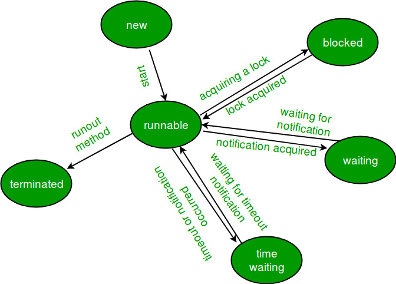
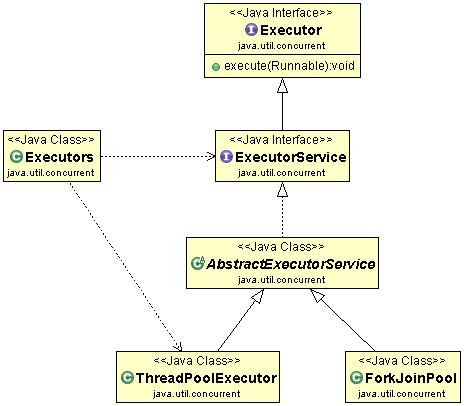

Two ways two create threads in JAVA

Class Ticket

When you extend Thread class, you can’t extend any other class which you require. (As you know, Java does not allow inheriting more than one class). 
When you implement Runnable, you can save a space for your class to extend any other class in future or now.

However, the significant difference is.

When you extends Thread class, each of your thread creates unique object and associate with it. 
When you implements Runnable, it shares the same object to multiple threads.

Life Cycle of a thread

1) New Thread: When a new thread is created, it is in the new state. The thread has not yet started to run when the thread is in this state. When a thread lies in the new state, its code is yet to be run and hasn’t started to execute.
2) Runnable State: A thread that is ready to run is moved to a runnable state. In this state, a thread might actually be running or it might be ready to run at any instant of time. It is the responsibility of the thread scheduler to give the thread, time to run.
A multi-threaded program allocates a fixed amount of time to each individual thread. Each and every thread runs for a short while and then pauses and relinquishes the CPU to another thread so that other threads can get a chance to run. When this happens, all such threads that are ready to run, waiting for the CPU and the currently running thread lie in a runnable state.
3) Blocked/Waiting state: When a thread is temporarily inactive, then it’s in one of the following states:
Blocked
Waiting
4) Timed Waiting: A thread lies in a timed waiting state when it calls a method with a time-out parameter. A thread lies in this state until the timeout is completed or until a notification is received. For example, when a thread calls sleep or a conditional wait, it is moved to a timed waiting state.
5) Terminated State: A thread terminates because of either of the following reasons:
Because it exits normally. This happens when the code of the thread has been entirely executed by the program.
Because there occurred some unusual erroneous event, like segmentation fault or an unhandled exception.

**Thread Pool**

Suppose we have web application server, and it is creating thread for every
request. In that case server would spend more time and consume more system resources in creating and destroying threads than processing actual requests.
Since active threads consume system resources, a JVM creating too many threads at the same time can cause the system to run out of memory. 
This necessitates the need to limit the number of threads being created.
The Thread Pool pattern helps to save resources in a multithreaded application and to contain the parallelism in certain predefined limits.

A thread pool reuses previously created threads to execute current tasks and offers a solution to the problem of thread cycle overhead and resource thrashing. 

**Executor framework**

1. Java provides the Executor framework which is centered around the Executor interface, its sub-interface –ExecutorService and the class-ThreadPoolExecutor, which implements both of these interfaces. By using the executor, one only has to implement the Runnable objects and send them to the executor to execute.
2. They allow you to take advantage of threading, but focus on the tasks that you want the thread to perform, instead of thread mechanics.
3. To use thread pools, we first create a object of ExecutorService and pass a set of tasks to it. ThreadPoolExecutor class allows to set the core and maximum pool size.The runnables that are run by a particular thread are executed sequentially.

**Executor**
The Executor interface has a single execute method to submit Runnable instances for execution.

**ExecutorService**
The ExecutorService interface contains a large number of methods to control the progress of the tasks and manage the termination of the service. Using this interface, we can submit the tasks for execution and also control their execution using the returned Future instance.

**Steps to be followed**

1. Create a task(Runnable Object) to execute
2. Create Executor Pool using Executors
3. Submit tasks to Executor Pool
4. Shutdown the Executor Pool

   **Risks in using Thread Pools**

5. Deadlock : While deadlock can occur in any multi-threaded program, thread pools introduce another case of deadlock, one in which all the executing threads are waiting for the results from the blocked threads waiting in the queue due to the unavailability of threads for execution.
6. Thread Leakage :Thread Leakage occurs if a thread is removed from the pool to execute a task but not returned to it when the task completed. As an example, if the thread throws an exception and pool class does not catch this exception, then the thread will simply exit, reducing the size of the thread pool by one. If this repeats many times, then the pool would eventually become empty and no threads would be available to execute other requests.
7. Resource Thrashing :If the thread pool size is very large then time is wasted in context switching between threads. Having more threads than the optimal number may cause starvation problem leading to resource thrashing as explained.

**Important Points**

1. Don’t queue tasks that concurrently wait for results from other tasks. This can lead to a situation of deadlock as described above.
2. Be careful while using threads for a long lived operation. It might result in the thread waiting forever and would eventually lead to resource leakage.
3. The Thread Pool has to be ended explicitly at the end. If this is not done, then the program goes on executing and never ends. Call shutdown() on the pool to end the executor. If you try to send another task to the executor after shutdown, it will throw a RejectedExecutionException.
4. One needs to understand the tasks to effectively tune the thread pool. If the tasks are very contrasting then it makes sense to use different thread pools for different types of tasks so as to tune them properly.
5. You can restrict maximum number of threads that can run in JVM, reducing chances of JVM running out of memory.
6. If you need to implement your loop to create new threads for processing, using ThreadPool will help to process faster, as ThreadPool does not create new Threads after it reached it’s max limit.
7. After completion of Thread Processing, ThreadPool can use the same Thread to do another process(so saving the time and resources to create another Thread.)

**Tuning Thread Pool**

The optimum size of the thread pool depends on the number of processors available and the nature of the tasks. On a N processor system for a queue of only computation type processes, a maximum thread pool size of N or N+1 will achieve the maximum efficiency.But tasks may wait for I/O and in such a case we take into account the ratio of waiting time(W) and service time(S) for a request; resulting in a maximum pool size of N*(1+ W/S) for maximum efficiency.

##
# **4. Shutting Down an**

# _ **ExecutorService** _

In general, the _ExecutorService_ will not be automatically destroyed when there is no task to process. It will stay alive and wait for new work to do.

In some cases this is very helpful, such as when an app needs to process tasks that appear on an irregular basis or the task quantity is not known at compile time.

On the other hand, an app could reach its end but not be stopped because a waiting _ExecutorService_ will cause the JVM to keep running.

To properly shut down an _ExecutorService_, we have the _shutdown()_ and _shutdownNow()_ APIs.

The _**shutdown()**_method doesn't cause immediate destruction of the _ExecutorService_. It will make the _ExecutorService_ stop accepting new tasks and shut down after all running threads finish their current work:

executorService.shutdown();

The _**shutdownNow()**_ method tries to destroy the _ExecutorService_ immediately, but it doesn't guarantee that all the running threads will be stopped at the same time:

List\<Runnable\> notExecutedTasks = executorService.shutDownNow();

This method returns a list of tasks that are waiting to be processed. It is up to the developer to decide what to do with these tasks.

One good way to shut down the _ExecutorService_ (which is also [recommended by Oracle](https://docs.oracle.com/en/java/javase/11/docs/api/java.base/java/util/concurrent/ExecutorService.html)) is to use both of these methods combined with the _**awaitTermination()**_ method:

executorService.shutdown();

try {

if (!executorService.awaitTermination(800, TimeUnit.MILLISECONDS)) {

executorService.shutdownNow();

}

} catch (InterruptedException e) {

executorService.shutdownNow();

}

With this approach, the _ExecutorService_ will first stop taking new tasks and then wait up to a specified period of time for all tasks to be completed. If that time expires, the execution is stopped immediately.

## Methods of Java ExecutorService

| **Method** | **Description** |
| --- | --- |
| boolean awaitTermination(long timeout, TimeUnit unit) | This method blocks the task to enter ExecutorService until all the tasks have completed after the shutdown request, or the given timeout occurs, or the current thread is interrupted, whichever happens first. |
| \<T\> List invokeAll(Collection\<? extends Callable\<T\>\> tasks) | This method executes the list of tasks given and returns the list of Futures which contain the results of all the tasks when completed. |
| \<T\> List invokeAll(Collection\<? extends Callable\<T\>\> tasks, long timeout, TimeUnit unit) | This method executes the list of tasks given and returns the list of Futures which contain the results of all the tasks when completed or the timeout expires, whichever occurs first. |
| \<T\> T invokeAny(Collection\<? extends Callable\<T\>\> tasks) | This method executes the list of tasks given and returns the result of one task which gets completed without throwing any exception. |
| \<T\> T invokeAny(Collection\<? extends Callable\<T\>\> tasks, long timeout,TimeUnit unit) | This method executes the list of tasks given and returns the result of one task which gets completed without throwing any exception before the timeout elapses. |
| boolean isShutdown() | This method returns whether the given executor is shut down or not. |
| boolean isTerminated() | This method returns true if all tasks have executed after shutdown. |
| void shutdown() | This method allows completion of previously submitted tasks to the ExecutorService and doesn?t allow any other tasks to be accepted. |
| List shutdownNow() | This method stops all the actively executing tasks, stops the execution of queued up tasks, and returns the list of tasks which are queued up. |
| \<T\> Future\<T\> submit(Callable\<T\> task) | This method submits a value-returning task for execution and returns the Future, which represents the pending result of the task. |
| Future\<?\> submit(Runnable task) | This method submits a task for execution and returns a Future representing that task. It returns null upon successful completion. |
| \<T\> Future\<T\> submit(Runnable task, T result) | This method submits a task for execution and returns a Future representing that task. |