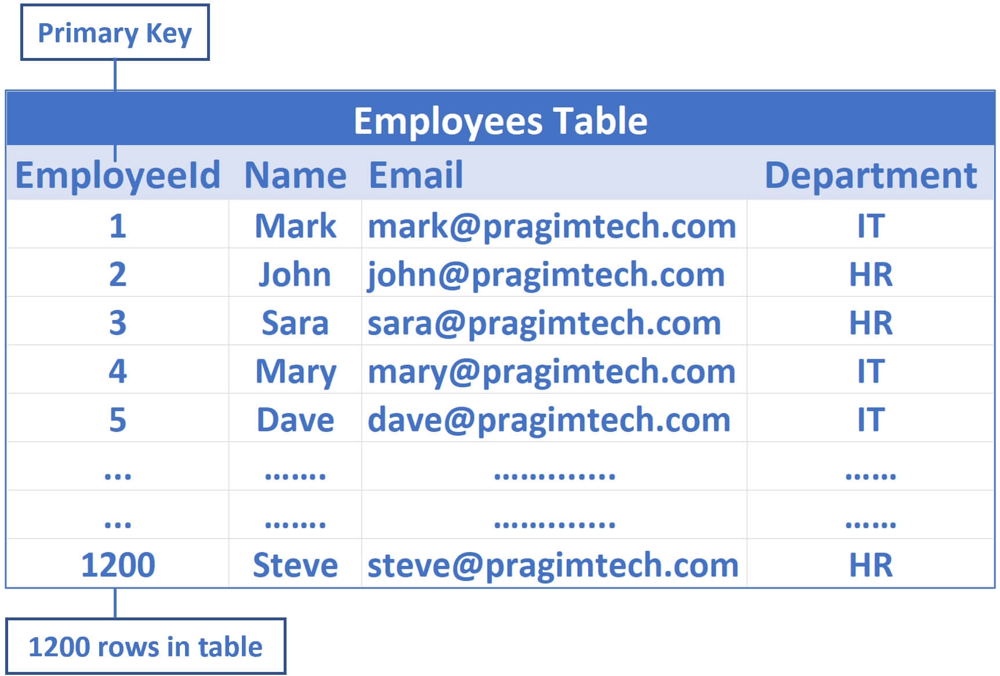
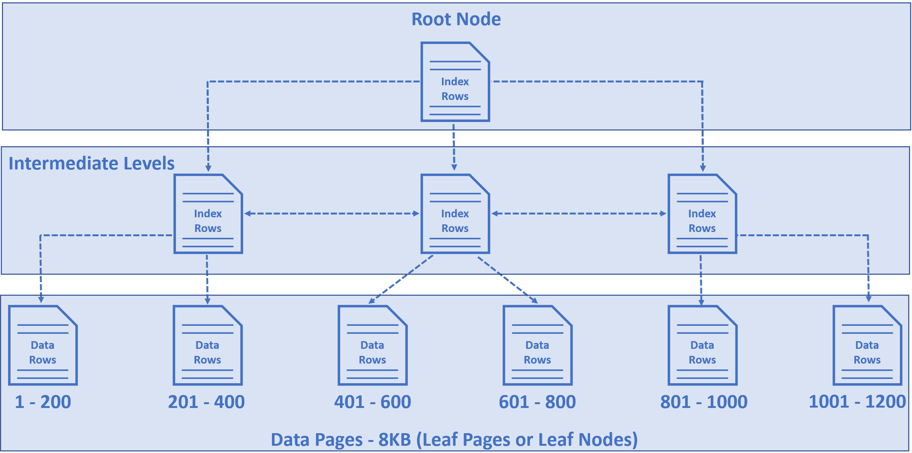
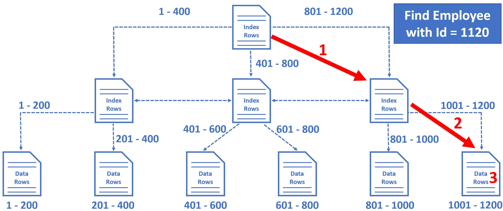
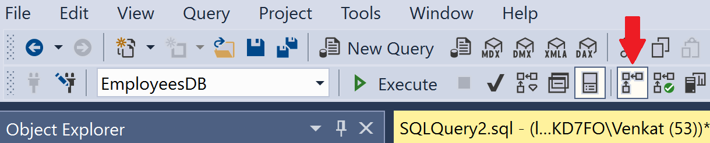
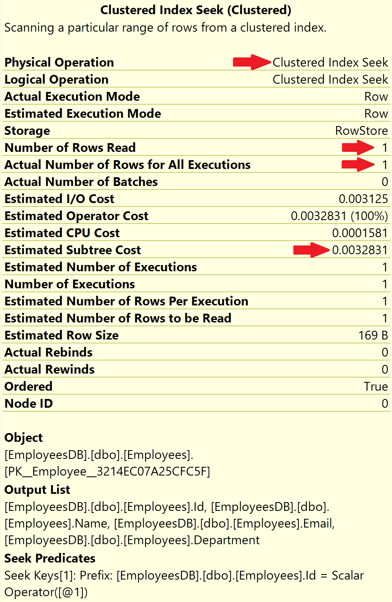
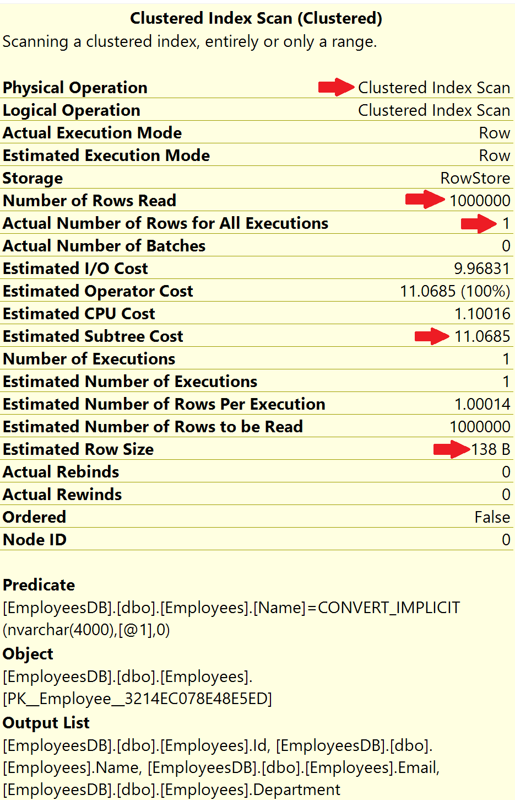
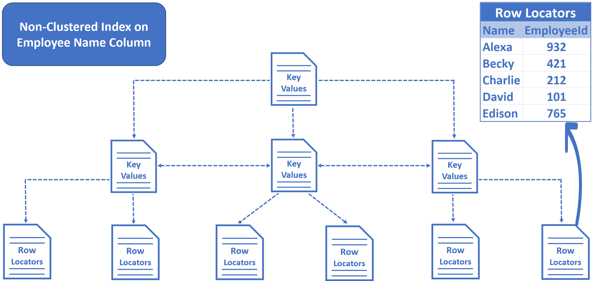
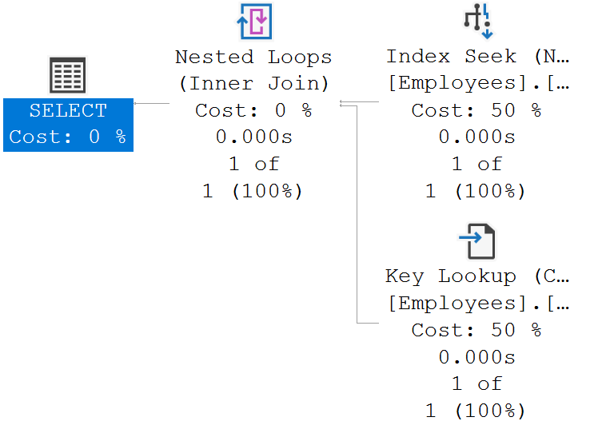
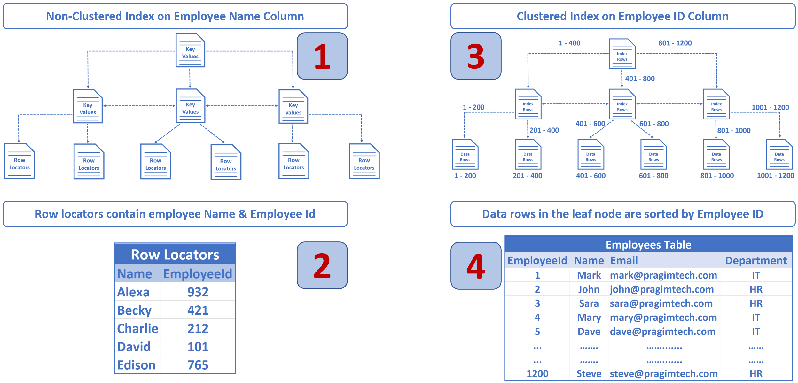
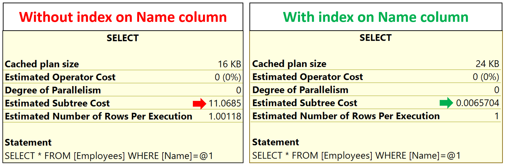

###
# How do sql indexes work

In this video we will discuss how indexes actually work and help improve the performance of our SQL queries. We will discuss how both the index types work - Clustered and Non-clustered.

##
# Clustered Index Structure

Consider the following Employees table

EmployeeId is the primary key, so by default a clustered index on the EmployeeId column is created. This means employee data is sorted by EmployeeId column and physically stored in a series of data pages in a tree-like structure that looks like the following.

- The nodes at the bottom of the tree are called data pages or leaf nodes and contain the actual data rows, in our case employee rows.
- These employee rows are sorted by EmployeeId column, because EmployeeId is the primary key and by default a clustered index on this column is created.
- For our example, let's say in the Employees table we have 1200 rows and let's assume in each data page we have 200 rows.
- So, in the first data page we have 1 to 200 rows, in the second 201 to 400, in the third 401 to 600, so on and so forth.
- The node at the top of the tree is called Root Node.
- The nodes between the root node and the leaf nodes are called intermediate levels.
- The root and and the intermediate level nodes contain index rows.
- Each index row contains a key value (in our case Employee Id) and a pointer to either an intermediate level page in the B-tree, or a data row in the leaf node.
- So this tree-like structure has a series of pointers that helps the query engine find data quickly.

##
# How SQL Server finds a row by ID

For example, let's say we want to find Employee row with EmployeeId = 1120

1. So the database engine starts at the root node and it picks the index node on the right, because the database engine knows it is this node that contains employee IDs from 801 to 1200.
2. From there, it picks the leaf node that is present on the extreme right, because employee data rows from 1001 to 1200 are present in this leaf node.
3. The data rows in the leaf node are sorted by Employee ID, so it's easy for the database engine to find the employee row with Id = 1120.

Notice in just 3 operations, SQL Server is able to find the data we are looking for. It's making use of the clustered index we have on the table. Let's look at this in action.

##
# Script to create Employees table

Create Table Employees

(

Id int primary key identity,

[Name]nvarchar(50),

Email nvarchar(50),

Department nvarchar(50)

)

Go

SET NOCOUNT ON

Declare @counter int=1

While(@counter \<=1000000)

Begin

Declare @Name nvarchar(50)='ABC '+RTRIM(@counter)

Declare @Email nvarchar(50)='abc'+RTRIM(@counter)+'@pragimtech.com'

Declare @Dept nvarchar(10)='Dept '+RTRIM(@counter)

Insert into Employees values (@Name, @Email, @Dept)

Set @counter = @counter +1

If(@Counter%100000=0)

Print RTRIM(@Counter)+' rows inserted'

End

Copy

##
# Clustered Index Seek

In SQL Server Management Studio click on Include Actual Execution Plan icon and then execute the following query

Select \*from Employees where Id =932000

Copy

The actual execution plan is below.

Notice, the operation is Clustered Index Seek, meaning the database engine is using the clustered index on the employee Id column to find the employee row with Id = 932000

- Number of rows read = 1
- Actual number of rows for all executions = 1

Number of rows read, is the number of rows SQL server has to read to produce the query result. In our case Employee Id is unique, so we expect 1 row and that is represented by Actual number of rows for all executions.

With the help of the index, SQL server is able to directly read that 1 specific employee row we want. Hence, both, Number of rows read and Actual number of rows for all executions is 1.

So the point is, if there are thousands or even millions of records, SQL server can easily and quickly find the data we are looking for, provided there is an index that can help the query find data.

##
# Clustered Index Scan

In this example, there is a clustered index on EmployeeId column, so when we search by employee id, SQL Server can easily and quickly find the data we are looking for. What if we search by Employee name? At the moment, there is no index on the Name column, so there is no easy way for sql server to find the data we are looking for. SQL server has to read every record in the table which is extremely inefficient from a performance standpoint.

Execute the following query with Include Actual Execution Plan turned ON

Select \*from Employees Where Name ='ABC 932000'

Copy

The actual execution plan is below.

Notice, the operation is Clustered Index Scan. Since there is no proper index to help this query, the database engine has no other choice than to read every record in the table. This is exactly the reason why Number of rows read is 1 million, i.e every row in the table

- Number of rows read = 1000000
- Actual number of rows for all executions = 1

How many rows are we expecting in the result? Well, only one row because there is only one employee whose Name = 'ABC 932000'. So, to produce this 1 row as the result, SQL server has to read all the 1 million rows from the table because there is no index to help this query. This is called Index Scan and in general, Index Scans are bad for performance.

##
# Non-Clustered Index in SQL Server

This is when we create a non-clustered index on the Name column.

CREATENONCLUSTEREDINDEX IX\_Employees\_Name

ON[dbo].[Employees]([Name])

Copy

- In an non-clustered index we do not have table data. We have key values and row locators.
- We created a non-clustered index on the Name column, so the key values, in this case Employee names are sorted and stored in alphabetical order.
- The row locators at the bottom of the tree contain Employee Names and cluster key of the row. In our example, Employee Id is the cluster key.

Execute the following query again with Include Actual Execution Plan turned ON

Select \*from Employees Where Name ='ABC 932000'

Copy

The following is the execution plan

We will discuss SQL Server Execution Plans in detail in our upcoming videos. For now, just understand, we read SQL Server execution plans from right to left and top to bottom.

##
# Non-clustered and clustered index in action

When we execute this query (Select \* from Employees where Name='David')

- SQL Server uses the non-clustered index on the Name column to quickly find this employee entry in the Index.
- In the non-clustered index along with the employee Name, we also have the cluster key (in our case employee ID).
- The database engine knows there is a clustered index on employee id, so this clustered index is then used to find the respective employee record.

Notice the Estimated Subtree Cost with and without non-clustered index on the Name column.

