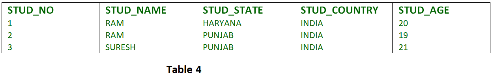

1. **Explain normalization ?**

Normalization is database design technique used to remove redundant dat.
Ex. Suppose in Employee table and country column US America or India or Bharat.
Create new table for these duplicate records.    

2. **How to implement normalization ?**

By splitting tables in to two, one with reference data ( master table) and other transaction data.    
    
3. **What is de-normalization ?**

It is database design technique used to improve records retrieval performance. We merge tables,
and we are ok with redundant data.

4. **Explain OLTP vs OLAP ?**

Maintain two databases
Online Transaction Processing - IUD   Normalization
Online Analytical Processing -   R    De-Normalization

5. **Explain 1st,2nd and 3rd Normal form ?**

(APT --> Atomic, Partial Dependency, Transient Dependency)

1NF :- A table is in first normal form when the columns have Atomic values. 
It should not have repeating groups or  composite or multivalued attribute. Otherwise, IUD Anomalies.
Ex. Name Column -> (Sachin, G, Kyle) or Phone Number -> (91 98473463)
So split this type of data into separate columns. or rows

2NF :-  1NF satisfied. All non-key columns should be fully dependent on the Primary key. 
Ex. Let's say we have FK for COURSE_NO, then there should not be any other column from that table.

      STUD_NO      COURSE_NO      COURSE_FEE
         1            C1             1000
         2            C2             1500
         1            C4             2000
         4            C3             1000
         4            C1             1000
         2            C5             2000

So split the table into two tables (STUD_NO, COURSE_NO) (COURSE_NO, COURSE_FEE)

3NF :- 1NF, 2NF Satisfied. Transitive dependency is not allowed.

Example 1 – In relation STUDENT given in Table 4,
FD set: {STUD_NO -> STUD_NAME, STUD_NO -> STUD_STATE, STUD_STATE -> STUD_COUNTRY, STUD_NO -> STUD_AGE}
Candidate Key: {STUD_NO}

For this relation in table 4, STUD_NO -> STUD_STATE and STUD_STATE -> STUD_COUNTRY are true. So STUD_COUNTRY is transitively dependent on STUD_NO. It violates the third normal form. To convert it in third normal form, we will decompose the relation STUDENT (STUD_NO, STUD_NAME, STUD_PHONE, STUD_STATE, STUD_COUNTRY_STUD_AGE) as:

STUDENT (STUD_NO, STUD_NAME, STUD_PHONE, STUD_STATE, STUD_AGE)

STATE_COUNTRY (STATE, COUNTRY)

BCNF :- 0% Redundancy.

6. **Primary Key vs Unique key ?**
NN --> Null & Number
PK --> Uniquely identify the record, not null, no duplicates, Only one Ex. Id
UK --> Uniquely identify the record, null allowed, no duplicates, One or more Ex. Email, Phone Numbers

7. **Differentiate between Char vs Varchar ?**

Fixed Size     Variable Size
Char(10) always takes 10 bytes even if we store one char

8. **Differentiate between Char vs NChar ?**

N -> Unicode 2bytes system
Ascii -> 1 byte

9. **What's the size of Char vs NChar ?**

10. **Function vs Stored Procedures**

Computed values but will not make any changes in env like Interest Rate, Count. Only Selects Allowed not IUD

11. **What are triggers and why do you need it ?**

Used to execute some logic before or after some events happen.

ALTER TRIGGER [dbo].[trg_data_manipulation] ON [dbo].[tblCustomer]
after INSERT, DELETE, UPDATE
AS
BEGIN
insert into tblAudit (Last updated) values (Getdate())
END

12. **What are types of triggers ?**
13. **Differentiate between After trigger vs Instead Of ?**

14. **Explain transactions and how to implement it ?**

It helps us to treat series of activities as single logical unit.
Either all the actions successful or all are rollbacks.

15. **What are inner joins ?**

Matching Rows from both the tables 
T <= L + R;

16. **Explain Left join ?**

All the rows from left table but only matching records from right table.

T = L; L can 0 or more null values if not match in R

17. **Explain Right join ?**

vice-versa of above one

18. **Explain Full outer joins ?**

Combination of L Join + R Join

T = Max(L, R);

19. **Explain Cross joins ?**

For each record in L all the record in R.

T = L * R;